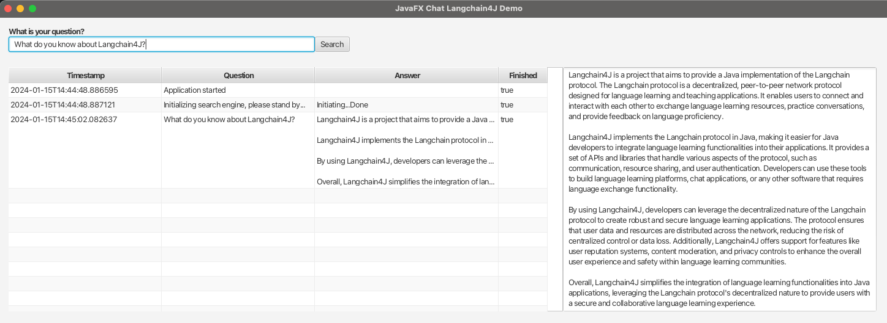

# JavaFX example using Langchain4J to provide a Chat user interface

To run this demo, use a JDK that has JavaFX bundled. For instance, using SDKMAN:

```
$ sdk install java 21.fx-zulu
$ mvn javafx:run
```

## Goal of this project

Demonstration of a JavaFX user interface to visualize the answer being streamed from OpenAI to the application. The
answer gets visualized into the right box and inside the table while it's being received.

All previous application and search actions get listed in the table.

The model keeps a memory with the previous chat messages, to keep track of the conversation.

This illustrates how the received answer can be handled using JavaFX bindings, and can be the starting point to build
your own JavaFX-based Langchain4J-implementation.

